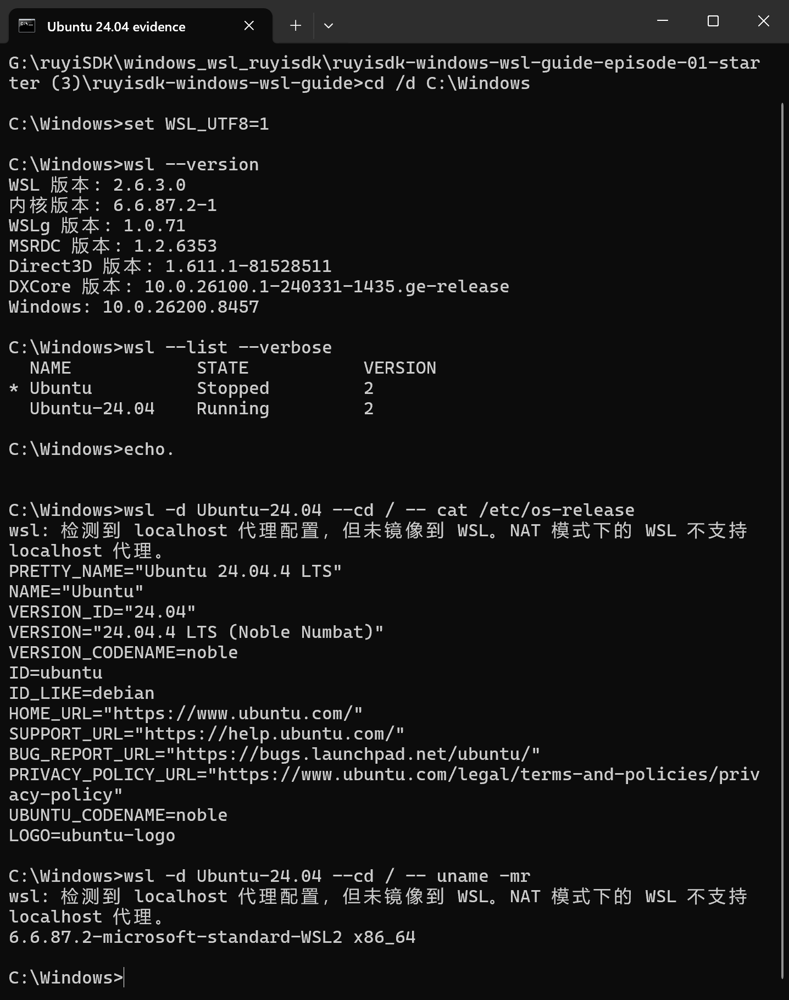
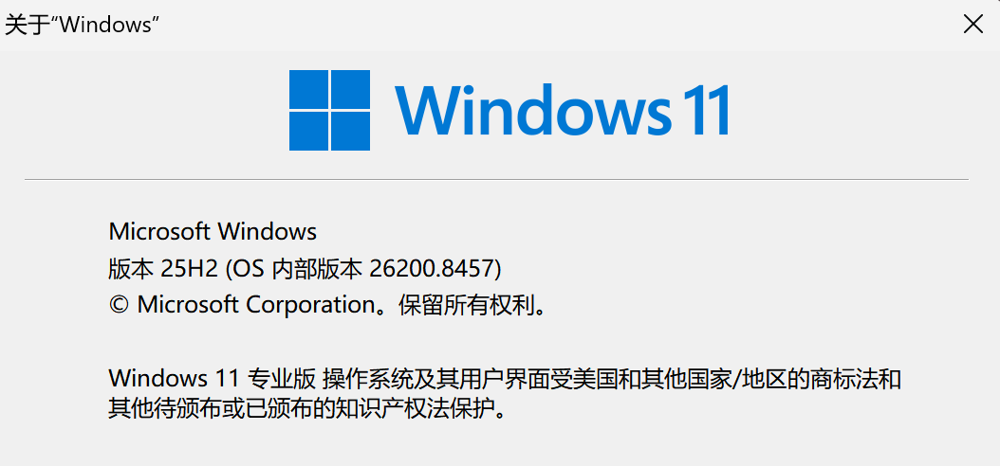

# 【RuyiSDK Windows/WSL 教程 01】安装并学会使用 WSL 2 与 Ubuntu 24.04

RuyiSDK 包管理器及后续使用的 RISC-V 工具链主要在 Linux 环境中运行。本节
先在 Windows 10/11 中准备 WSL 2 和 Ubuntu 24.04，让没有接触过 Linux 的
读者也能完成安装、首次登录和基本操作。

本文使用的测试机已经安装过 WSL，因此安装部分按照 Microsoft 官方流程说明，
验证部分来自真实环境。已有 WSL 的读者不需要卸载重装，直接从“第 6 步：验证
安装结果”开始即可。

## 完成本节后，你应该能做到什么

- 知道 Windows、WSL 2 和 Ubuntu 分别负责什么；
- 在 Windows 中安装并启动 Ubuntu 24.04；
- 分清 PowerShell 命令和 Ubuntu/Linux 命令；
- 知道 Linux 用户名、密码和项目目录放在哪里；
- 确认 Ubuntu 正在使用 WSL 2；
- 为下一节安装 RuyiSDK 包管理器做好准备。



## 0. 先理解三个名称

### Windows

你正在使用的桌面操作系统。开始菜单、文件资源管理器、PowerShell、Windows
Terminal 和录屏软件都运行在 Windows 中。

### WSL 2

WSL 的全称是 Windows Subsystem for Linux。它让 Windows 可以运行一个完整的
Linux 环境，不需要另外安装双系统。WSL 2 是目前推荐使用的版本。

### Ubuntu 24.04

Ubuntu 是安装在 WSL 2 中的 Linux 发行版。后续的 Linux 命令、RuyiSDK
包管理器、RISC-V 工具链和 QEMU 都会在这个 Ubuntu 环境中运行。

可以把三者理解为：Windows 是日常使用的桌面，WSL 2 是连接 Windows 与
Linux 的运行层，Ubuntu 是实际执行 Linux 命令的环境。

## 1. 判断自己应该从哪里开始

### 情况 A：从未安装过 WSL 或 Ubuntu

从第 2 步开始，按顺序完成安装、重启、首次启动和验证。

### 情况 B：已经安装过 WSL 或 Ubuntu

不要为了录制或复现教程而卸载已有环境。打开 PowerShell，运行：

```powershell
wsl --list --verbose
```

如果列表中已经有 `Ubuntu-24.04`，直接跳到第 6 步验证。如果只有其他 Ubuntu
版本，可以保留原发行版，再按照第 3 步安装 `Ubuntu-24.04`。

## 2. 检查 Windows 版本

1. 按下 `Win + R`；
2. 输入 `winver`；
3. 按 Enter；
4. 记下 Windows 版本和 OS 内部版本号（Build）。

本文的一键安装命令适用于 Windows 11，或 Windows 10 版本 2004、Build
19041 及以上版本。版本过旧时，应先通过 Windows Update 更新系统。



本次实测环境如下：

| 项目 | 实测值 |
|---|---|
| 测试日期 | 2026-07-17（UTC+8） |
| Windows | Windows 11 专业版 25H2 |
| Windows Build | 26200.8457 |
| Windows 架构 | 64 位 |
| WSL | 2.6.3.0 |
| WSL 内核包 | 6.6.87.2-1 |
| Linux 内核 | 6.6.87.2-microsoft-standard-WSL2 |
| Linux 发行版 | Ubuntu 24.04.4 LTS（Noble Numbat） |
| Linux 架构 | x86_64 |

## 3. 用管理员 PowerShell 安装 WSL 2 和 Ubuntu 24.04

### 3.1 打开正确的窗口

1. 点击 Windows 开始菜单；
2. 搜索“PowerShell”或“终端”；
3. 右键单击搜索结果，选择“以管理员身份运行”；
4. 出现用户账户控制提示时选择“是”。

窗口中的提示符通常以 `PS C:\...>` 开头。这是 Windows PowerShell，下面的
`wsl` 命令需要在这里运行，不要先打开 Ubuntu。

### 3.2 查看可安装的发行版名称

```powershell
wsl --list --online
```

在返回列表中确认存在 `Ubuntu-24.04`。发行版名称必须按列表中的写法输入。

### 3.3 设置新发行版默认使用 WSL 2

```powershell
wsl --set-default-version 2
```

这个设置只决定之后新安装的发行版默认使用 WSL 2，不会删除已有发行版。

### 3.4 安装 Ubuntu 24.04

```powershell
wsl --install -d Ubuntu-24.04
```

这条命令会启用 WSL 所需组件、安装 Linux 内核并下载 Ubuntu 24.04。等待命令
完成，不要在下载过程中关闭终端。

如果系统提示必须重启，请先保存正在编辑的文件，然后重启 Windows。重启后
继续第 4 步。

## 4. 首次启动 Ubuntu 并创建 Linux 用户

1. 打开 Windows 开始菜单；
2. 搜索并打开“Ubuntu 24.04 LTS”；
3. 第一次启动时，等待文件解压和初始化；
4. 看到 `Enter new UNIX username` 后，输入一个 Linux 用户名并按 Enter；
5. 看到 `New password` 后输入密码并按 Enter；
6. 再输入一次密码完成确认。

输入 Linux 密码时，屏幕不会显示字符、圆点或星号。这不是键盘失灵，而是
Linux 终端的正常安全设计。直接输入完整密码后按 Enter 即可。

Linux 用户名和密码只属于这个 Ubuntu 发行版，不要求与 Windows 账户相同。
以后执行带 `sudo` 的管理命令时，需要输入这里设置的 Linux 密码。

初始化完成后，终端会出现类似下面的提示符：

```text
linuxuser@computer:~$
```

看到末尾的 `$`，说明已经进入 Ubuntu 的 Bash 终端。

## 5. 分清 PowerShell 和 Ubuntu 终端

后续教程会同时出现 Windows 命令和 Linux 命令，先记住下面的区别：

| 窗口 | 常见提示符 | 主要用途 | 本文代码块标记 |
|---|---|---|---|
| PowerShell | `PS C:\...>` | 管理 WSL、查看发行版、启动 Ubuntu | `powershell` |
| Ubuntu/Bash | `user@host:~$` | 执行 Linux、RuyiSDK 和工具链命令 | `bash` |

不要在 Ubuntu 中直接照抄 `PS C:\...>`，也不要在 PowerShell 中直接运行只适用
于 Linux 的 `sudo`、`apt`、`chmod` 等命令。

## 6. 验证安装结果

打开普通 PowerShell，不需要管理员权限，依次运行下面四条命令。

### 6.1 查看 WSL 版本

```powershell
wsl --version
```

能够看到 WSL 版本和内核版本，说明 `wsl` 命令可以正常使用。

### 6.2 确认 Ubuntu 24.04 使用 WSL 2

```powershell
wsl --list --verbose
```

重点查看 `Ubuntu-24.04` 所在行。最后一列 `VERSION` 应为 `2`。`STATE` 显示
`Running` 或 `Stopped` 都是正常状态；它只表示发行版此刻是否正在运行。

### 6.3 查看 Ubuntu 版本

```powershell
wsl -d Ubuntu-24.04 --cd / -- cat /etc/os-release
```

输出中应包含 `Ubuntu 24.04` 和 `VERSION_ID="24.04"`。

### 6.4 查看 Linux 内核和处理器架构

```powershell
wsl -d Ubuntu-24.04 --cd / -- uname -mr
```

本文实测输出包含 `microsoft-standard-WSL2` 和 `x86_64`。不同时间安装的 WSL
内核小版本可能不同，不需要与本文数字完全一致。

本机实测结果为：

- WSL 版本为 2.6.3.0；
- `Ubuntu-24.04` 的 `VERSION` 为 `2`；
- Ubuntu 版本为 24.04.4 LTS；
- Linux 内核为 6.6.87.2-microsoft-standard-WSL2；
- 处理器架构为 x86_64。

## 7. 日常怎样进入和退出 Ubuntu

### 从开始菜单进入

在开始菜单中搜索“Ubuntu 24.04 LTS”并打开，这是对新手最直观的方法。

### 从 PowerShell 进入指定发行版

```powershell
wsl -d Ubuntu-24.04
```

提示符从 `PS C:\...>` 变为 `user@host:...$` 后，就已经进入 Linux。

### 退出 Ubuntu，回到 PowerShell

在 Ubuntu 中运行：

```bash
exit
```

### 完全关闭 WSL 2

通常直接关闭终端即可，不需要每天手动关机。排查网络或配置问题时，可以在
PowerShell 中运行：

```powershell
wsl --shutdown
```

这会结束当前所有 WSL 发行版，请先保存正在运行的任务。

## 8. 用几条基础命令熟悉 Linux

下面的命令都在 Ubuntu 终端中执行。

### 查看当前目录

```bash
pwd
```

首次进入时一般位于 `/home/你的Linux用户名`，也就是个人主目录。

### 查看当前目录中的文件

```bash
ls -la
```

Linux 文件名区分大小写，`Test.txt` 和 `test.txt` 会被视为两个不同文件。

### 回到个人主目录

```bash
cd ~
```

符号 `~` 代表当前 Linux 用户的主目录。

### 创建本系列的工作目录

```bash
mkdir -p ~/ruyisdk-work
cd ~/ruyisdk-work
pwd
```

如果最后输出类似 `/home/linuxuser/ruyisdk-work`，说明目录已经创建并进入。
后续 RuyiSDK 示例可以统一放在这里。

### 用 Windows 文件资源管理器打开当前 Linux 目录

```bash
explorer.exe .
```

命令末尾的点号代表“当前目录”，不要漏掉。文件资源管理器会打开 Ubuntu 中的
对应目录。

## 9. Windows 路径和 Linux 路径怎样对应

在 Ubuntu 中：

- Windows 的 `C:\` 对应 `/mnt/c/`；
- Windows 的 `D:\` 对应 `/mnt/d/`；
- Linux 个人目录通常是 `/home/你的Linux用户名/`；
- 在 Windows 文件资源管理器地址栏输入 `\\wsl$`，可以查看各个 WSL 发行版。

后续主要使用 Linux 工具处理的项目，建议放在 `~/ruyisdk-work` 这类 Linux
目录中。把大量 Linux 项目文件放在 `/mnt/c/` 下虽然可以访问，但文件操作性能
和权限行为可能与 Linux 主目录不同。

## 10. 可选：使用仓库中的检查脚本

仓库根目录提供了三个 Windows 启动文件：

- `START-01-PREFLIGHT.cmd`：只读检查 Windows、虚拟化和现有 WSL 状态；
- `START-01-VERIFY.cmd`：验证 WSL、Ubuntu、内核和架构；
- `START-01-EVIDENCE.cmd`：打开便于核对版本信息的窗口。

这些脚本用于减少重复输入，不是完成本节的必要条件。第一次学习时，建议先
理解上面的命令分别在哪个窗口运行。

## 11. 常见问题

### 运行 `wsl --install` 后只显示帮助信息

这通常表示电脑已经安装了 WSL，但还没有安装目标发行版。先运行：

```powershell
wsl --list --online
```

确认名称后再运行：

```powershell
wsl --install -d Ubuntu-24.04
```

### 下载长时间停在 0.0%

可以改用网络下载方式：

```powershell
wsl --install --web-download -d Ubuntu-24.04
```

如果仍然失败，先检查 Windows 是否能正常访问 Microsoft 服务，不要连续运行
来源不明的网络或注册表修复命令。

### 出现 `0x80370102`

这个错误常与 Virtual Machine Platform 或 BIOS/UEFI 中的 CPU 虚拟化设置
有关。请保存完整错误文本，根据电脑品牌查询虚拟化开关位置，再参考 Microsoft
WSL 故障排查文档。

### 出现 localhost 代理未镜像到 WSL 的警告

本文测试机出现过这一提示。它不影响本节确认 WSL 2 和 Ubuntu 能否启动，但
可能影响之后下载软件包。先记录警告，不要直接复制其他人的代理地址和端口。
下一节会单独测试 DNS 与 HTTPS 访问。

### 电脑中有多个 Ubuntu，不知道命令进入了哪一个

先运行：

```powershell
wsl --list --verbose
```

然后始终用 `-d Ubuntu-24.04` 明确指定发行版：

```powershell
wsl -d Ubuntu-24.04
```

本文测试机同时存在 `Ubuntu` 和 `Ubuntu-24.04`，因此所有验证命令都明确指定
了 `Ubuntu-24.04`。

## 12. 本节验收清单

- [ ] 能说清 PowerShell 和 Ubuntu 终端的区别；
- [ ] `wsl --version` 能返回版本信息；
- [ ] `wsl --list --verbose` 中存在 `Ubuntu-24.04`；
- [ ] `Ubuntu-24.04` 对应的 `VERSION` 为 `2`；
- [ ] 能进入 Ubuntu，并使用 `pwd`、`ls`、`cd`；
- [ ] 已创建 `~/ruyisdk-work`；
- [ ] 能用 `explorer.exe .` 从 Windows 打开当前 Linux 目录。

全部完成后，Windows + WSL 2 + Ubuntu 24.04 基础环境就准备好了。

## 下一节

下一节将检查 Ubuntu 的 DNS 和 HTTPS 连接，处理可能出现的代理提示，并安装、
验证 RuyiSDK 包管理器。

## 参考资料

- [Microsoft：安装 WSL](https://learn.microsoft.com/windows/wsl/install)
- [Microsoft：WSL 基本命令](https://learn.microsoft.com/windows/wsl/basic-commands)
- [Microsoft：设置 WSL 开发环境](https://learn.microsoft.com/windows/wsl/setup/environment)
- [Microsoft：在 Windows 与 Linux 文件系统之间工作](https://learn.microsoft.com/windows/wsl/filesystems)
- [Microsoft：WSL 故障排查](https://learn.microsoft.com/windows/wsl/troubleshooting)
